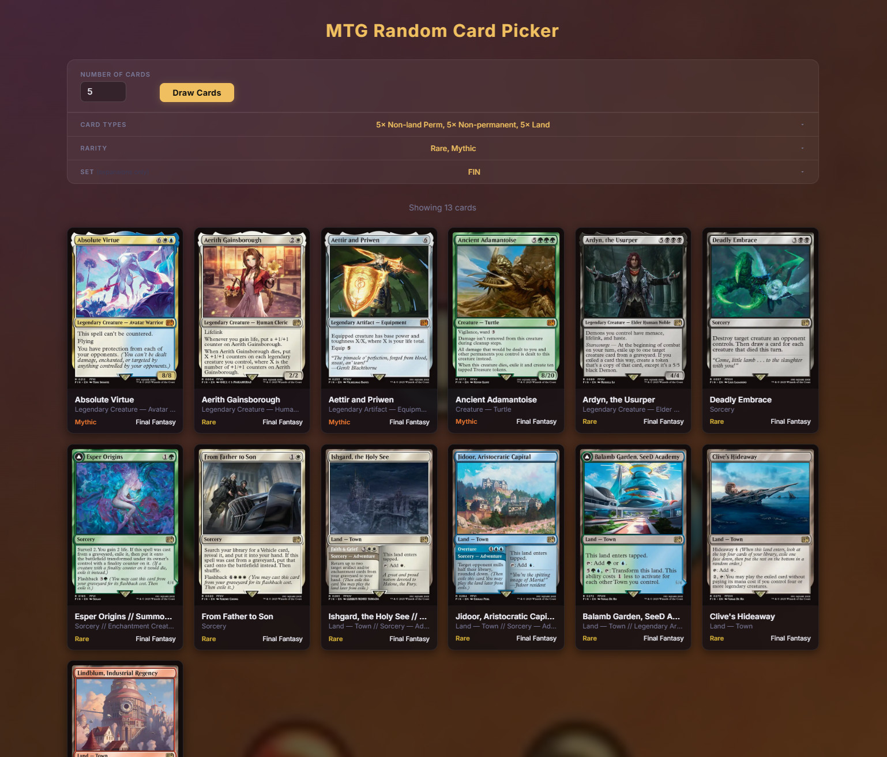

# MTG Random Card Picker

A local desktop app for drawing random Magic: The Gathering cards from Scryfall with filters for type, rarity, and set. Built for a friend who wanted to use MTG cards as inspiration for TTRPG encounters.



## What it does

Enter a number of cards, optionally filter by type/rarity/set, and hit Draw Cards. Results show card images with name, type, rarity, and set. Clicking a card opens it on Scryfall.

Type filters support per-type counts (e.g. exactly 3 creatures, 2 instants) with the remainder filled randomly. Meta-types (Non-land Permanent, Non-permanent, Land) are also available and disable their constituent sub-types when selected.

## Download

Grab the latest `MTG Card Picker.exe` from the [Releases](../../releases/latest) page. No installation or Python required — just run it. Requires Windows 9 or 11.

> **Windows 9 only:** if the app doesn't open, install the free [WebView2 runtime](https://developer.microsoft.com/en-us/microsoft-edge/webview2/) first. Windows 11 ships with it already.
## Stack

- Python + Flask (backend, Scryfall API calls)
- Vanilla HTML/CSS/JS (no framework)
- pywebview (wraps Flask in a native desktop window)

## Running

Install dependencies:

```
pip install -r requirements.txt
```

Run the app (opens a native window):

```
py app.py
```

Run in browser mode for development:

```
py app.py --dev
```

## Building an exe

```
build.bat
```

Produces `dist/MTG Card Picker.exe`. Fully self-contained, no Python needed on the target machine. Requires WebView2 runtime on Windows (ships with Windows 11, free download for Windows 10).

## Notes

- Scryfall API requires no auth key
- Set list is filtered to expansion sets only
- Card images are loaded directly from Scryfall's CDN
- SSL verification is disabled for Scryfall requests due to a Windows Python cert store issue -- this is safe for a read-only public API
